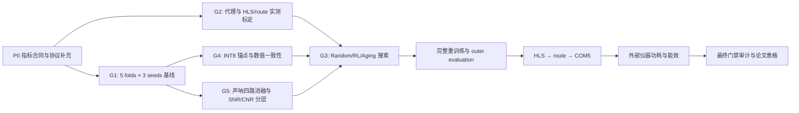

# CCF A/B 对标、评测指标与实验计划（2026-07-15）

## 1. 目的与适用边界

本文为当前 HW-NAS / FPGA / 声呐图像分类项目建立一套可执行、可审计的对标方案。目标不是把不同数据集、不同 FPGA 和不同任务上的论文数值直接横向排名，而是：

1. 从近三年的 CCF A/B 高质量论文中抽取可复用的评测协议、指标和开源实现；
2. 冻结本项目搜索策略、识别质量、声呐鲁棒性、FPGA 性能和功耗五类指标；
3. 将论文方法映射为本项目可运行的基线或评测适配器；
4. 给出受当前 measurement-first 门禁约束的分阶段实验计划；
5. 明确哪些结果可以形成论文主张，哪些仍只能标记为 `PENDING`、`FROZEN`、`PAUSED` 或 `NOT_MEASURED`。

术语说明：本仓库当前实现的是 **NAS（神经架构搜索）策略**，即标量奖励 RL 与多目标 aging evolution；代码检索未发现已实现的 **MAS（multi-agent system，多智能体系统）**。为避免把用户原词静默改写，本文采用双分支：S0/S1/S2 是当前可落地的 NAS 主比较；若“MAS”确指多智能体架构设计，则采用 NADER 分支 MA0/MA1/MA2，单独评测 agent 有效性与成本，不能把两类结果混成一个方法标签。

## 2. 当前项目事实边界

截至 2026-07-19，`artifacts/measurement_first_rebuild/status.json` 的状态为：

| 门禁 | 状态 | 本计划中的含义 |
|---|---|---|
| G0 protocol | `PASS` | 协议骨架存在，但新增 SNR、统计和功耗字段仍须形成带版本的补充协议 |
| G1 accuracy baselines | `PASS` | 45/45 个正式外层评测单元通过完整性与来源检查；该结论不替代后续搜索、硬件或板级证据 |
| G2 hardware measurement | `PENDING` | 全网代理标定样本、独立探针和质量阈值未闭合；不能用代理值替代板上实测 |
| G3 search | `FROZEN` | 新搜索结果不能作为论文证据 |
| G4 INT8 board | `PENDING` | INT8 锚点、HLS/route/board 证据链未闭合 |
| power | `NOT_MEASURED` | 当前没有同一仪器、同一协议下至少 3 个候选的可比功耗数据 |
| G5 sonar ablation | `PAUSED` | 声呐算子消融尚未形成最终 E1/E2/G5 证据 |

因此，本文确定的是“指标合同和实验路线”，不是新增实验结果。本轮不启动训练、综合、上板或功耗采集。

正式证据继续遵守以下分层，任何汇总表都不得把它们压成一个“综合性能”字段：

- 搜索代理；
- 完整重训练与外层评测；
- INT8 数值一致性；
- HLS 综合；
- Vivado route/timing；
- COM5 固定输入板上验证；
- 声呐图像质量或结构效应；
- 置信度校准；
- 外部仪器功耗。

## 3. 文献检索与筛选方法

### 3.1 检索范围

- 检索日期：2026-07-15。
- 时间窗口：2023-01-01 至 2026-07-15。
- 数据源：OpenAlex 多主题检索、Crossref DOI 元数据核验、arXiv、CCF 官方目录、会议/出版社正式页面、作者或实验室官方 GitHub 仓库。
- CCF 口径：采用 CCF 于 2026-03-31 发布的第七版目录。CCF 明确会议只计 Full/Regular paper，Workshop、Short、Demo、Technical Brief 等不计入目录口径。

### 3.2 主要检索式

以下检索式在 OpenAlex 中按相关度检索，并在正式论文页、Crossref 和代码仓库中交叉核验：

```text
multi-objective hardware-aware neural architecture search
hardware-aware neural architecture search FPGA
FPGA deep neural network accelerator power latency
side-scan sonar image classification deep learning
sonar image classification robustness speckle noise
long-tailed image classification robust corruption
```

### 3.3 严格纳入条件

“严格可复现对标集”必须同时满足：

1. 2023 年以后发表；
2. 正式发表在当前 CCF A/B 会议或期刊；
3. 与多目标 NAS、代理可靠性、分类鲁棒性、HLS/FPGA 或板上功耗至少一项直接相关；
4. 存在作者或实验室官方公开代码仓库；
5. 论文元数据、DOI/正式页面和代码归属可以交叉核验。

排除规则：Workshop 论文、只有第三方复现、只有演示没有完整代码、任务完全无关、无法核验正式发表信息的工作，不进入严格集。它们可以作为方法补充，但不能写成“已选择的可复现 CCF A/B 基线”。

## 4. 论文与开源代码选择

### 4.1 严格可复现 CCF A/B 对标集

| 论文 | 年份与 CCF 等级 | 正式页面 / DOI | 官方代码 | 对本项目的用途 | 直接数值可比性 |
|---|---|---|---|---|---|
| Multi-objective Hardware-Aware NAS with Pareto Rank-preserving Surrogate Models（HW-PR-NAS） | ACM TACO 2023，CCF A | [IBM/ACM 论文页](https://research.ibm.com/publications/multi-objective-hardware-aware-neural-architecture-search-with-pareto-rank-preserving-surrogate-models)，[DOI](https://doi.org/10.1145/3579853) | [IHIaadj/HW-PR-NAS](https://github.com/IHIaadj/HW-PR-NAS) | 多目标代理的 Pareto 排名、排序相关性、代理误差和 Pareto 前沿质量；直接指导 G2 | 否；搜索空间、设备和数据集不同，只复用评测方法 |
| PreNAS: Preferred One-Shot Learning Towards Efficient NAS | ICML 2023，CCF A | [PMLR](https://proceedings.mlr.press/v202/wang23f.html) | [tinyvision/PreNAS](https://github.com/tinyvision/PreNAS) | 搜索效率、零成本代理、候选筛选和 Pareto 前沿；作为“低搜索成本”参考 | 否；其超网和 ImageNet 资源规模与本项目不同 |
| NADER: Neural Architecture Design via Multi-Agent Collaboration | CVPR 2025，CCF A | [CVF 论文页](https://openaccess.thecvf.com/content/CVPR2025/html/Yang_NADER_Neural_Architecture_Design_via_Multi-Agent_Collaboration_CVPR_2025_paper.html) | [yang-ze-kang/NADER](https://github.com/yang-ze-kang/NADER) | 若 MAS 指多智能体系统：Reader/Proposer/Modifier/Reflector 分工、可执行率、修改质量、成功率和 token/API 成本 | 条件可比；须冻结同一初始网络、候选/修改预算、算子白名单、训练协议和硬件约束 |
| SURE: SUrvey REcipes for building reliable and robust deep networks | CVPR 2024，CCF A | [CVF 论文页](https://openaccess.thecvf.com/content/CVPR2024/html/Li_SURE_SUrvey_REcipes_for_building_reliable_and_robust_deep_networks_CVPR_2024_paper.html) | [Intellindust-AI-Lab/SURE](https://github.com/Intellindust-AI-Lab/SURE) | 长尾、标签噪声、数据腐蚀和失败预测；直接锚定 AURC、AUROC、FPR95 与 corruption 分层 | 否；作为评测配方，不把 CIFAR 数值与 NKSID 比较 |
| Allo: A Programming Model for Composable Accelerator Design | PLDI 2024，CCF A | [PLDI 正式页面](https://pldi24.sigplan.org/details/pldi-2024-papers/25/Allo-A-Programming-Model-for-Composable-Accelerator-Design)，[DOI](https://doi.org/10.1145/3656401) | [cornell-zhang/allo](https://github.com/cornell-zhang/allo) | 可组合加速器、端到端生成、验证和多后端；指导 HLS 证据组织和功能等价验证 | 否；编程模型与本项目 HLS 模板不同 |
| Robust GNN-Based Representation Learning for HLS（HARP） | ICCAD 2023，CCF B | [DOI](https://doi.org/10.1109/ICCAD57390.2023.10323853) | [UCLA-VAST/HARP](https://github.com/UCLA-VAST/HARP) | HLS 代理预测、跨工具版本稳健性、排序和 DSE；直接指导 G2 的跨版本/跨核验集审计 | 否；基准核与本项目完整 CNN 不同 |
| ESDA: A Composable Dynamic Sparse Dataflow Architecture for Efficient Event-based Vision Processing on FPGA | FPGA 2024，CCF B | [DOI](https://doi.org/10.1145/3626202.3637558) | [CASR-HKU/ESDA](https://github.com/CASR-HKU/ESDA) | 完整的软件精度—量化—综合—bitstream—延迟—功耗—端到端一致性 artifact 结构 | 否；事件视觉、ZCU102 和本项目 AV7K325 不同 |

这 7 篇论文不是 7 个必须完整移植的模型。推荐复用级别为：

- **指标/协议级复用**：HW-PR-NAS、HARP、SURE；
- **artifact 和证据链级复用**：Allo、ESDA；
- **MAS 条件分支复用**：NADER；仅在 MAS 确认为研究变量后进入适配，不与当前 NAS runner 混用；
- **可选算法级复现**：PreNAS，仅在资源允许且不改变冻结主比较时作为扩展实验。

### 4.2 声呐领域锚点与不可复现边界

本轮检索未识别到同时满足“近三年 + CCF A/B + 声呐分类 + 官方开源代码”的论文。这是截至检索日、在已列数据源与检索式下的证据边界，不等价于断言全球不存在此类工作，也不应通过降低核验标准来填表。

| 论文 | 等级与代码状态 | 适用方式 |
|---|---|---|
| Lambertian-based adversarial attacks on deep-learning-based underwater side-scan sonar image classification | Pattern Recognition 2023，当前 CCF B；[DOI](https://doi.org/10.1016/j.patcog.2023.109363)；未核验到官方公开代码 | 物理/对抗鲁棒性的论文级方法锚点，不进入复现实验基线 |
| A Convolutional Vision Transformer for Semantic Segmentation of Side-Scan Sonar Data | Ocean Engineering 2023，非 CCF A/B；[DOI](https://doi.org/10.1016/j.oceaneng.2023.115647)；[官方代码 CIRS-Girona/s3Tseg](https://github.com/CIRS-Girona/s3Tseg) | 复用小样本声呐数据处理、mIoU/FPS 报告和真实声呐域协议；任务是分割，不能与分类 top1/macro-F1 直接比较 |
| SID-TGAN: A Transformer-Based Generative Adversarial Network for Sonar Image Despeckling | Remote Sensing 2023，非 CCF A/B；[论文全文](https://www.mdpi.com/2072-4292/15/20/5072)；未核验到官方公开代码 | 指标级锚点：有配对 clean target 时用 PSNR/SSIM；真实无参考声呐图像用 ENL/SSI/SMPI，并同时检查下游任务，不能移植其原始数值 |
| MOTE-NAS: Multi-Objective Training-based Estimate for Efficient NAS | NeurIPS 2024，CCF A；[正式页面](https://proceedings.neurips.cc/paper_files/paper/2024/hash/b6e118c759c16f2424997bbb6a1ffd61-Abstract-Conference.html)；本次未核验到官方代码 | 低成本训练相关估计与 coarse-to-fine 搜索参考；未进入严格可复现集 |
| Quasar-ViT: Hardware-Oriented Quantization-Aware Architecture Search for Vision Transformers | ICS 2024，CCF B；[DOI](https://doi.org/10.1145/3650200.3656622)；本次未核验到官方代码 | FPGA 友好量化感知模型—硬件协同搜索参考；不作为复现基线 |

补充说明：MODNAS（ICLR 2025）有[官方代码](https://github.com/automl/MODNAS)，但当前 CCF 第七版人工智能目录中未列 ICLR，故只能作为开源多目标 NAS 补充方法，不能标为 CCF A/B 对标论文。

## 5. 冻结的指标合同

### 5.1 NAS 搜索策略效果

搜索策略必须把“控制器/采样器”“标量奖励”“Pareto 选择”和“板上可声明证据”分开。当前主比较为：

1. 随机搜索：预算和约束完全相同的下界基线；
2. 当前标量奖励 RL：保留现有实现；
3. 多目标 aging evolution：主要候选方法；
4. PreNAS/MODNAS：仅作资源允许时的扩展，不替代上述冻结主比较。

主指标：

| 类别 | 指标 | 说明 |
|---|---|---|
| 可行性 | feasible ratio | 满足 LUT/DSP/BRAM/带宽等硬约束的候选数 / 总候选数 |
| Pareto 集质量 | 双向覆盖率 `C(A,B)` 与 `C(B,A)` | 不依赖任意标量权重；报告 A 支配 B 中多少解及反向结果 |
| Pareto 集规模 | unique feasible non-dominated count | 去重后可行非支配解数量 |
| Hypervolume | normalized exact HV | 只有在目标方向、归一化边界和 reference point 预先冻结，且当前 placeholder 实现被精确算法替换后才可作为正式主指标 |
| 任务质量 | best/median `f_clean`、`f_robust` | 同时报告，不允许只报标量 reward |
| 搜索成本 | GPU-hours、wall-clock、候选/小时、峰值显存 | 包含代理训练、搜索和候选短训的完整成本 |
| 稳定性 | 每种方法跨 seed 的成功率与指标分布 | 不只报告最佳 seed |

搜索主终点冻结为每个 paired seed 上的 `Delta exact normalized HV`（aging evolution 减去比较基线）；目标方向、归一化上下界与 reference point 必须在运行前冻结。双向覆盖率、feasible ratio、`f_clean`、`f_robust` 和搜索成本属于关键确认/解释指标。exact HV 未实现或边界未冻结时，搜索优越性主张保持 `FROZEN`，不得临时改用对 aging 更有利的指标。

双向覆盖率定义：

```text
C(A,B) = |{ b in B : exists a in A, a dominates b }| / |B|
```

代理可靠性指标：

- Kendall `tau` 和 Spearman `rho`：连续目标排序；
- top-k recall / precision：代理选出的前 k 个候选与实测前 k 的重合；
- NDCG@k：前部排序质量；
- MAE、RMSE、sMAPE：延迟、能耗和资源回归误差；
- false-feasible rate：代理判为可行、实际 HLS/route 不可行的比例；
- false-infeasible rate：代理错误丢弃潜在可行候选的比例；
- calibration plot：预测分位与实测分位的一致性；
- 不同 Vivado/Vitis 版本或不同候选族上的 held-out 泛化。

禁止项：在 G2 未闭合时，把 `latency_ms`、`energy_mj` 代理值写成 AV7K325 实测；把当前粗略 hypervolume placeholder 写成正式 HV；用一个标量 reward 替代 Pareto 结果。

当前 `f_robust` 的既有 corruption 合同应保持不变并单独报告：speckle variance `0.01`、speckle variance `0.04`、contrast factor `0.70`、`3×3` blur，`f_robust` 为这些条件下 macro-F1 的平均值。新增 SNR 曲线属于扩展鲁棒性协议，不能事后改写既有 `f_robust` 的定义；若希望将 SNR 纳入搜索目标，必须在新一轮搜索前另发带版本的 protocol amendment。

#### 5.1.1 若 MAS 指多智能体系统：独立指标合同

NADER 将架构设计看成 Reader、Proposer、Modifier、Reflector 的协作。该分支的首要问题不是“agent 聊得是否合理”，而是同一预算下能否产生可执行、满足意图并最终带来可复现模型/硬件收益的架构。

| 类别 | 指标 | 本项目口径 |
|---|---|---|
| 生成有效性 | executability `E` | 通过静态 shape、算子白名单、可训练 smoke test 与 HLS 导出前置检查的候选比例 |
| 指令一致性 | quality `Q` | 在可执行候选中，满足预注册修改意图与约束的比例；由规则检查和盲审共同决定 |
| 综合成功率 | success rate `SR` | 同时满足可执行、意图一致和硬约束的比例，定义必须在运行前固定 |
| 最终效果 | `Delta macro_f1`、Pareto 贡献、feasible ratio | 完整训练/代理评测层分开报告，不能以 agent 自评替代 |
| 探索效率 | unique valid architectures / trial、重复/同构率、有效改进率 | 图同构去重后计算 |
| agent 成本 | input/output tokens、API 费用、agent wall-clock、失败重试数 | 同时记录 LLM 提供方、精确模型名/版本、temperature、prompt SHA 和响应日志 |
| 总成本 | GPU-hours + agent/API cost | agent 费用与候选训练费用分列，不压成一个不可解释分数 |

MAS 消融冻结为：MA0 单 agent/无经验反馈，MA1 多 agent 但移除 Reader 或 Reflector/LIF/LDE，MA2 完整协作。三者使用同一初始网络、同一修改次数、同一训练预算、同一文献快照和同一硬件可行性检查；正式运行至少记录 5 个 paired seeds，若作稳定优越性主张仍建议 10 个。NADER 原论文的 `E/Q/SR/# Tokens` 定义可复用，但其 CIFAR/NAS-Bench-201 数值不能直接作为本项目 NKSID/AV7K325 的基线数字。

该分支存在额外可复现风险：外部 LLM 服务可能漂移。必须缓存完整输入/输出、模型版本、时间戳和费用；若模型版本不可固定，结果应标为服务快照实验。NADER 允许开放架构空间，而本项目 HLS 模板只支持有限算子，因此论文主比较应采用“共同可部署算子白名单”；开放空间探索只能作为附加实验，不能与受限 NAS 的成功率直接排名。

### 5.2 声呐图像分类

主指标：

- `macro_f1`：唯一主分类指标，适合类别不平衡；
- `top1`：重要次指标；
- balanced accuracy；
- 每类 precision、recall、F1 与 support；
- 归一化和原始计数 confusion matrix；
- 失败预测：AURC、AUROC、FPR95 与 selective risk curve；其中 SURE 直接提供 AURC/AUROC/FPR95 的评测锚点；
- 概率校准：NLL、Brier score、ECE；这是本项目独立增加的标准校准指标，不应写成全部来自 SURE。

报告单位为 5 个 outer folds × 3 个 seeds 的 15 个配对评测单元。每个单元都必须保存预测、标签、样本 ID、fold、seed、checkpoint SHA、数据指纹和配置哈希。正式分类入口仍为 `run_eval_protocol.py`，outer validation 只消费一次。

当前数据缺少可冻结的 acquisition group（采集航次/场景/目标实例组）元数据，因此现有 outer split 尚不能认证为 group-safe。补齐并审计 group ID 之前，结果只能说明当前样本级划分下的泛化，不能声称跨航次、跨海域或跨目标实例泛化；E11 外部泛化也不能用同源随机切分替代。

统计汇总：

- 报告 15 个单元的均值、标准差和完整散点；
- 置信区间使用以 outer fold 为簇、seed 为簇内重复的分层配对 bootstrap；
- 方法比较报告配对差值、95% CI 和标准化效应量，不以单个 p-value 代替效应大小；
- 同一系列多重消融使用 Holm 校正；
- 最佳 checkpoint 选择只能使用 inner validation，禁止查看 outer validation 后选择模型。

### 5.3 声呐噪声、SNR 与图像质量

本项目需要区分三种完全不同的场景：

#### A. 有干净参考和已知注入噪声

使用固定随机种子生成受控噪声。仅对可定义噪声功率的加性噪声与乘性 speckle 使用输入 SNR 水平 `[-10, -5, 0, 5, 10, 15, 20] dB`；对比度衰减和模糊必须使用独立、预注册的 severity（严重度）轴，不能伪装成 dB SNR。报告：

- 每个 SNR 下的 macro-F1、top1 和每类 recall；
- `F1-SNR AUC`：按预注册区间对 macro-F1—SNR 曲线积分并归一化；
- worst-SNR macro-F1；
- 相对下降 `DeltaF1 = F1_clean - F1_corrupt`；
- 输出 SNR 提升量，仅在信号和噪声真值可分离时报告；
- PSNR/SSIM，仅在存在对齐的干净目标时报告。

SNR 统一定义为：

```text
SNR_dB = 10 * log10(mean(signal^2) / mean(noise^2))
```

这里的 SNR 是**图像域合成 SNR**，不是换能器/接收机链路的物理声学 SNR。噪声应在归一化前的线性强度域注入；每张图保存 requested SNR、由实际 `noise = corrupt - clean` 复算的 achieved SNR、噪声类型与参数、随机种子以及裁剪/饱和像素比例。若原始像素不是线性声强，只能标记为 image-domain SNR。`F1-SNR AUC` 只在同一冻结 dB 网格和同一噪声族内比较，不能把 blur/contrast severity 混入一条 SNR 曲线。

#### B. 真实声呐图像、没有干净配对目标

不能把输入图像自身当作“干净真值”来声称复原质量。应报告：

- 目标/背景/均匀背景 ROI 规则、冻结版本及盲审一致性；
- CNR 或 SCR；
- 背景 ENL；必要时补充 SSI、SMPI，但三者都必须绑定同一冻结 ROI；
- 分类 macro-F1、top1 和 per-class recall 随 CNR/SCR 分层的变化；
- 误差案例按阴影、混响、斑点、低对比度和视角分组。

ENL/SSI/SMPI 是无参考局部统计量，可能偏好过度平滑，不能单独证明“图像更好”。它们必须与边缘/结构检查及下游分类指标共同报告；ROI 不得根据某个方法的输出重新挑选。

#### C. 当前 `input_as_reference` 的 PSNR/SSIM

只能描述算子相对输入造成的结构变化，必须显式标记 `input_as_reference`；不得写成去噪/复原质量，不得进入 Pareto 主目标，不得与有真实 clean target 的论文 PSNR/SSIM 横向比较。

### 5.4 FPGA 与板上性能

硬件指标分为四级报告：

| 级别 | 必报指标 | 证据要求 |
|---|---|---|
| INT8 数值级 | float/INT8 macro-F1、top1 差值；逐层或端到端最大绝对/相对误差；饱和率；bit-exact mismatch | 固定输入、权重哈希、量化配置、参考实现 |
| HLS 级 | latency cycles、initiation interval、目标/估算时钟；LUT、FF、DSP、BRAM 绝对数与占用率 | HLS 报告、工具版本、配置、RTL/IP 哈希 |
| Route 级 | WNS、TNS、achieved clock、最终 LUT/FF/DSP/BRAM、布线后功耗估计仅作估计值 | Vivado 实现报告、bitstream SHA、板卡 part |
| Board 级 | kernel 与 end-to-end latency 的 p50/p95/p99；throughput/FPS；重复次数；主机传输是否包含 | 固定输入集、串口原始日志、bitstream SHA、时钟和温度环境 |

资源指标不得只报百分比，必须同时给绝对值。延迟必须区分：

- HLS 估算 latency；
- route 后按实际时钟换算的 kernel latency；
- COM5 固定输入端到端 latency；
- 主机预处理、传输和后处理是否包含。

不同 FPGA、时钟、输入分辨率、精度和网络拓扑的论文原始延迟不做“谁更快”的直接排名。跨论文只比较指标完整性和方法；本项目主结论只来自同一 AV7K325、同一输入、同一仪器和同一软件栈的受控比较。

模型规模和数据移动同样需要保留：参数量、MACs/OPs、权重与激活存储量、片外 DDR 访问量或带宽（若工具链可可靠测得）。带宽只有代理值时必须标注 `proxy`，不得写成板上实测。

### 5.5 功耗与能效

当前 AV7K325 串口路径不能替代功耗仪器，power 保持 `NOT_MEASURED`，直到外部仪器数据闭合。至少对三个预注册候选进行同协议测量：

1. accuracy-first；
2. sonar-robust；
3. deployment-balanced。

每个候选至少执行：3 个 idle block + 3 个 active block，每个 active block 至少 1000 次推理；记录时间戳、功率或电压/电流、有效推理数、端到端延迟、bitstream SHA、板温、时钟和仪器信息。

主功耗指标：

```text
P_idle      = mean(idle power)
P_dynamic   = mean(active power) - P_idle
E_dynamic   = 1000 * integral(P_active(t) - P_idle, dt) / inference_count   # mJ/inference
FPS_per_W   = throughput_fps / mean(active power)
```

同时报告：active total power、dynamic power、dynamic energy/inference、FPS/W。若可可靠计算有效 MAC/OP 数，再补充 GOPS/W；否则不为追求表格完整度而编造 GOPS。

## 6. 基线与消融矩阵

### 6.1 搜索方法

| ID | 方法 | 预算 | 角色 |
|---|---|---|---|
| S0 | Random search | 200 candidates/method/seed，3 evaluation epochs | 搜索下界 |
| S1 | 当前 scalar-reward RL | 同预算、同 seed、同 GPU 互斥条件 | 现有主基线 |
| S2 | Multi-objective aging evolution | 同预算、同 seed、同 GPU 互斥条件 | 主要候选方法 |
| S3 | PreNAS 风格预筛选 | 另行预算，不并入冻结主比较 | 扩展搜索效率实验 |
| S4 | NADER 风格 MAS/NAD | 独立 MA0/MA1/MA2 预算，不并入 S0/S1/S2 冻结主比较 | 仅当 MAS 确认为研究变量；评测多智能体协作 |

S0/S1/S2 使用完全相同的搜索空间、代理快照、硬约束和候选短训协议。运行顺序按 seed 反平衡，避免温度、缓存或后台负载与方法绑定。

实现审计边界：当前 `scripts/run_aging_vs_rl_benchmark.py` 的等预算启动器只生成 S1/S2（RL 与 aging evolution）任务；仓库核心虽已有 `RandomSearcher`，S0 尚未接入同一启动器、反平衡顺序和配对汇总。E5 启动前必须增加 random 配置/启动适配与测试，否则正式主比较只能写成 S1 vs S2，不能在表中假装 S0 已执行。

### 6.2 识别与声呐算子

| 维度 | 水平 |
|---|---|
| 基础网络 | MobileNetV2 固定锚点；当前 legacy candidate；搜索得到的三个候选角色 |
| 初始化 | scratch；若合法且协议预注册，可加入 ImageNet pretrained |
| 声呐算子 | `no_sonar`、`denoise_only`、`edge_only`、`denoise_edge` |
| 数值精度 | FP32、PTQ INT8；只有 PTQ 精度门禁失败时再增加 QAT |
| 数据质量 | clean/原始；固定 corruption；受控 SNR；真实低 CNR/SCR 分层 |

四路声呐算子消融必须在同一 fold/seed 上配对，使用相同样本划分、训练预算和初始化策略。PSNR/SSIM 若为 `input_as_reference`，只在附表中解释结构变化，不参与“最佳模型”选择。

## 7. 分阶段实验计划

### 7.1 总体依赖关系



### 7.2 可执行实验表

| 阶段 | 实验 | 重复与规模 | 主输出 | 进入条件 | 退出条件 |
|---|---|---|---|---|---|
| P0 | 冻结 metric contract、SNR/CNR 定义、HV reference point、统计方案 | 1 次版本化冻结 | 协议补充、schema、配置哈希 | 现在可做 | 审计脚本能拒绝缺字段或错误证据层 |
| E1 | MobileNetV2/legacy accuracy baseline | 5 folds × 3 seeds × 规定基线 | macro-F1、top1、per-class、预测 JSONL | G0 PASS | G1 45/45 完整且无 outer leakage |
| E2 | 四路声呐算子消融 | 4 operators × 5 folds × 3 seeds | 配对 macro-F1/top1、结构效应附表 | G1 基线可用 | G5 完整且比较状态为 ready |
| E3 | 鲁棒性与 SNR/CNR | 每个候选 × corruption/SNR 层级 × 5×3 | F1-SNR 曲线、worst-F1、CNR 分层误差 | P0 冻结且算子输出可追溯 | 所有噪声种子、掩膜或 ROI 规则可复现 |
| E4 | G2 代理标定 | 至少 8 个语义安全全网样本，覆盖资源/拓扑范围 | tau/rho、top-k、误差、false-feasible | freeze manifest 已验证 | G2 审计 PASS；HLS 覆盖与独立探针闭合 |
| E5 | 搜索主比较 | S0/S1/S2 × paired seeds × 200 candidates | Pareto 集、覆盖率、精确 HV、搜索成本 | G1/G2/G4/G5、S0 同协议 runner 与人工 Stage 3 放行 | 每 seed 完整、无 GPU 重叠、候选去重可审计 |
| E5-MAS | 多智能体架构设计 | MA0/MA1/MA2 × paired seeds × 冻结修改预算 | E/Q/SR、token/API 成本、有效改进率、最终 Pareto 贡献 | MAS 术语确认、NADER 适配、算子白名单与 LLM 快照协议冻结 | 全部 prompt/response/费用可追溯，候选通过同一训练与硬件门禁 |
| E6 | 候选完整重训练 | 三类候选 × 5 folds × 3 seeds | 正式 macro-F1/top1/CI/校准 | 搜索冻结后候选清单签名 | outer predictions 完整且只消费一次 |
| E7 | INT8 | 三类候选 × 15 单元或预注册代表协议 | INT8 精度下降、数值一致性 | E6 候选冻结 | 精度门禁和 bit-exact 门禁闭合 |
| E8 | HLS/route | 三类候选，完整网络 | cycles、II、资源、WNS/TNS、achieved clock | E7 PASS | 三者同工具链完成 route-clean |
| E9 | COM5 board | 三类候选 × 至少 3 个重复 block | p50/p95/p99、FPS、原始串口日志 | bitstream SHA 与 freeze manifest 匹配 | 固定输入结果与参考一致，日志可追溯 |
| E10 | 外部仪器功耗 | 三类候选 × 3 idle + 3 active blocks | W、mJ/inference、FPS/W | E9 PASS，仪器路径就绪 | 同仪器同协议 CSV 和时间同步审计通过 |
| E11 | 外部声呐泛化 | 数据集/任务分别报告 | domain shift 结果 | 许可证、标签和任务映射审核 | 不把检测/分割数据与 NKSID 分类混成一个指标 |

## 8. 重复次数与统计判定

### 8.1 搜索策略

仓库当前冻结计划使用 3 个 seeds（42、43、44），可以作为预注册 pilot 和效应量估计，但不能用双侧 exact sign test 得到 `p < 0.05`。若要在论文中作“方法稳定优于基线”的统计主张：

- 最低增加到 6 个 paired seeds；即使 6/6 同向，双侧 exact sign test 才可达到 `2 / 2^6 = 0.03125`；
- 推荐目标为 10 个 paired seeds，以获得更稳定的分布和 CI；
- 扩展 seed 数必须在查看 3-seed 胜负结论前通过带时间戳的 preregistration amendment 冻结，避免 optional stopping；
- 每个 seed 比较 S0/S1/S2 的配对差值，并报告胜负、效应量和 CI。

若算力不足，只执行 3 seeds，则论文措辞限于“在预注册的三个 seeds 下观察到……”，不得写成普遍显著优越。

### 8.2 分类、鲁棒性与功耗

- 分类：outer fold 为统计簇；seed 为簇内重复；报告分层 paired bootstrap 95% CI。
- 声呐消融：对每个 fold/seed 的方法差值做配对分析；多算子比较用 Holm 校正。
- SNR：用预注册的曲线 AUC 和 worst-SNR F1，避免在多个 SNR 点逐点挑选显著结果。
- 功耗：每个候选的 idle/active block 保留原始时间序列；先计算 block 级指标，再对候选做配对或 bootstrap CI，不能把高频采样点误当作独立样本。

## 9. 论文代码复现策略

不要直接把六个外部仓库的依赖合入项目环境。按以下顺序执行：

1. 在 `external_repro/<paper>/` 或独立工作树中记录仓库 URL、commit SHA、license、环境文件和下载日期；
2. 优先运行作者提供的最小 smoke test 或已发布 checkpoint 评测；
3. 记录成功/失败命令、硬件、CUDA/工具版本、数据许可和输出路径；
4. 只把经过审计的指标实现或适配器移植到本项目；
5. 对移植代码写小型合成测试，验证方向、单位、边界条件和去重逻辑；
6. 任何外部论文数字都放在“原论文设置”列，不与 AV7K325 本地实测混合。

优先级：

- P1：实现或核验 exact normalized hypervolume、Pareto coverage、Kendall tau、top-k recall 和 false-feasible rate；
- P1：按 SURE 直接补齐 AURC/AUROC/FPR95 与 corruption 分层；另以本项目校准协议补齐 ECE/NLL/Brier，保留 macro-F1 主分类指标；
- P1：把 RandomSearcher 接入等预算 runner、反平衡顺序与 paired-seed 汇总，补齐 S0 的同协议测试；
- P1：按 ESDA artifact 结构补齐软件—硬件端到端结果核验和功耗原始数据导出；
- P2（仅 MAS 分支）：先复现 NADER 官方 smoke test，再实现本项目算子白名单、E/Q/SR 检查器和 MA0/MA1/MA2 消融；不得直接让外部 agent 改写正式搜索代码或绕过 gate；
- P2：参考 HARP 做跨 Vivado/Vitis 版本或 held-out topology 的代理泛化检查；
- P3：资源允许时再评估 PreNAS 风格候选预筛选。

## 10. 结果表格设计

最终论文至少需要四张互不混合的主表；若启用 MAS 分支，再增加第五张表：

### 表 A：搜索策略

`method, seed, budget, feasible_ratio, pareto_count, C_vs_baseline, HV, best_f_clean, best_f_robust, GPU_hours, peak_VRAM`

### 表 B：识别与鲁棒性

`candidate, operator, macro_f1, top1, balanced_accuracy, worst_class_f1, ECE, AURC, F1_SNR_AUC, worst_SNR_F1`

### 表 C：HLS/route/board

`candidate, precision, LUT, FF, DSP, BRAM, HLS_cycles, II, WNS, achieved_MHz, kernel_p50_ms, e2e_p50_ms, e2e_p95_ms, FPS`

### 表 D：功耗

`candidate, bitstream_sha, P_idle_W, P_active_W, P_dynamic_W, E_dynamic_mJ, FPS_per_W, instrument, sample_rate, repeats`

### 表 E（仅 MAS 分支）：多智能体策略

`variant, seed, llm_snapshot, trials, E, Q, SR, unique_valid, isomorphic_rate, improved_rate, input_tokens, output_tokens, API_cost, agent_wall_clock, training_GPU_hours`

论文图建议：

1. `macro_f1–latency–energy` Pareto 图，点形区分可行/不可行，颜色区分方法；
2. macro-F1 随 SNR 的曲线及 95% CI；
3. 三候选的资源利用与 route timing 小倍图；
4. active/idle 功率时间序列和每次推理动态能量分布。

## 11. Go/No-Go 与可声明边界

| 主张 | 最低证据 | 当前状态 |
|---|---|---|
| aging evolution 优于 RL | 同预算 paired seeds、可审计 Pareto 集、精确 HV/覆盖率、完整搜索成本；统计措辞与 seed 数匹配 | `FROZEN` |
| MAS 协作优于单 agent | MA0/MA1/MA2 配对消融、E/Q/SR、最终模型收益、token/API/GPU 全成本和 LLM 快照追溯 | `NOT_IMPLEMENTED` |
| 声呐算子提升识别 | 四路 5×3 配对结果、macro-F1 主指标、Holm 校正、无 outer leakage | `PAUSED` |
| 对噪声更稳健 | 受控 SNR 或真实 CNR/SCR 分层、F1-SNR AUC、worst-SNR F1 | `PENDING` |
| INT8 可部署 | 精度下降在预注册阈值内、数值一致性、完整网络 HLS/route | `PENDING` |
| AV7K325 延迟更低 | 同板卡、同输入、同 bitstream 追溯、p50/p95/p99 | `PENDING` |
| 功耗/能效更优 | 外部仪器、三候选、同协议、动态能量与 CI | `NOT_MEASURED` |
| 去噪质量更好 | 必须有配对 clean target 的 PSNR/SSIM 或有物理意义的 CNR/SCR 证据 | 当前 `input_as_reference` 不足以支持 |

任何一项最低证据未满足时，结果表中必须保留上述状态标签，不允许用历史 fold0、HLS 估算、COM5 固定输入或输入自参考 PSNR/SSIM 补位。

## 12. 建议的近期执行顺序

1. 将本指标合同转为版本化 schema 和 gate audit 检查，不启动搜索；
2. G1 的 45/45 正式 baseline 单元已完成，后续执行须继续绑定同一冻结协议与 source-freeze 证据；
3. 并行补齐 G2 的语义安全全网标定样本、独立探针和 exact HV 实现；
4. 完成 G4 INT8 锚点以及 G5 四路声呐消融；
5. 审计通过后执行 S0/S1/S2 的 3-seed pilot；
6. 若 MAS 确认为主研究变量，单独完成 NADER smoke test 和 MA0/MA1/MA2 预注册 pilot，不改变 S0/S1/S2 的冻结协议；
7. 若要作显著性主张，在不查看胜负结论前把 paired seeds 扩展到至少 6、推荐 10；MAS 分支建议直接目标 10 seeds；
8. 冻结三类候选后依次完成重训练、HLS、route、COM5 和外部仪器功耗；
9. 最后运行 `python scripts/audit_measurement_first_gates.py` 生成正式 ledger，并据此决定哪些论文表格单元可以解除冻结。

## 13. 核心来源

- [CCF 第七版目录发布说明](https://www.ccf.org.cn/Academic_Evaluation/By_category/)
- [CCF 人工智能目录](https://www.ccf.org.cn/Academic_Evaluation/AI/)
- [CCF 体系结构目录](https://www.ccf.org.cn/Academic_Evaluation/ARCH_DCP_SS/)
- [CCF 软件工程/系统软件/程序设计语言目录](https://www.ccf.org.cn/Academic_Evaluation/TCSE_SS_PDL/)
- [HW-PR-NAS 论文与代码](https://research.ibm.com/publications/multi-objective-hardware-aware-neural-architecture-search-with-pareto-rank-preserving-surrogate-models)
- [PreNAS 论文](https://proceedings.mlr.press/v202/wang23f.html)
- [NADER CVPR 2025 论文与官方代码](https://github.com/yang-ze-kang/NADER)
- [SURE 论文](https://openaccess.thecvf.com/content/CVPR2024/html/Li_SURE_SUrvey_REcipes_for_building_reliable_and_robust_deep_networks_CVPR_2024_paper.html)
- [Allo PLDI 2024](https://pldi24.sigplan.org/details/pldi-2024-papers/25/Allo-A-Programming-Model-for-Composable-Accelerator-Design)
- [HARP 代码](https://github.com/UCLA-VAST/HARP)
- [ESDA 代码与复现说明](https://github.com/CASR-HKU/ESDA)
- [s3Tseg 声呐分割代码](https://github.com/CIRS-Girona/s3Tseg)
- [SID-TGAN 声呐去斑指标定义](https://www.mdpi.com/2072-4292/15/20/5072)
