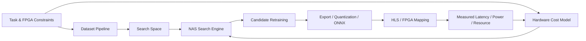

# 整体架构设计

## 1. 问题定义

目标任务是水下声呐图像分类与识别，在嵌入式资源受限场景下，通过硬件感知神经架构搜索自动得到满足 FPGA 资源与实时性约束的 CNN，并进一步完成训练、导出和部署。

从你现有问题模型抽出来，核心输入输出如下：

- 输入
  - 单通道声呐图像及标签
  - 目标 FPGA 硬件规格
  - 延迟、功耗、存储、模型大小等约束
- 输出
  - 可部署 CNN 架构
  - 训练后权重与精度结果
  - FPGA 映射配置、导出文件和实测指标

## 2. 候选仓库的定位

### 2.1 推荐采用的方式

- `HW-NAS-Bench`
  - 用途：借鉴硬件代价 API、指标组织方式、代理建模思路
  - 不足：它提供的是已有 benchmark 空间的硬件信息，不是你目标声呐任务的直接搜索框架
- `FBNet`
  - 用途：借鉴 stage-based 搜索空间、可微搜索、延迟正则化思路
  - 结论：适合作为主线工程参考
- `TinyTNAS`
  - 用途：借鉴部署约束优先、硬件感知、多目标搜索思路
  - 结论：适合作为“约束处理和搜索流程”参考
- `DARTS`
  - 用途：保留作可微 NAS 基线
  - 结论：不建议直接作为主线工程骨架

### 2.2 最终建议

主线采用：

- `FBNet 风格的 stage-based 超网`
- `TinyTNAS 风格的约束驱动多目标搜索`
- `HW-NAS-Bench 风格的硬件代价查询接口`

换句话说，不建议直接硬套某一个仓库，而是按你的任务重组一个面向 FPGA 部署的工程。

## 3. 顶层系统分层



分成 6 层最清楚：

1. 数据与任务层
2. 搜索空间层
3. 硬件代价建模层
4. 搜索器层
5. 重训练与评估层
6. 部署映射层

## 4. 搜索空间设计

### 4.1 为什么不能照搬通用图像 NAS

声呐图像与自然 RGB 图像不同：

- 单通道输入
- 边界模糊
- 纹理和几何结构更重要
- 噪声特性更强

因此搜索空间不应默认采用太重的 RGB backbone，也不宜保留大量 FPGA 不友好的算子。

### 4.2 推荐搜索空间

以 hierarchical / stage-based 结构为主，每个 stage 搜索 block 类型、深度和宽度：

- 输入 stem
  - `Conv3x3 + BN + Act`
- searchable block
  - `Conv3x3`
  - `DepthwiseConv3x3 + PointwiseConv1x1`
  - `MBConv(k=3, expand=2/4)`
  - `FusedMBConv(k=3, expand=2)`
  - `Skip` 仅在通道匹配时允许
- stage-level choices
  - `depth in {1, 2, 3, 4}`
  - `channels in {16, 24, 32, 48, 64, 96}`
  - `kernel in {3, 5}`，优先保留 `3`
  - `stride pattern` 固定，只搜索局部微结构
- deployment-aware choices
  - 量化位宽：`8-bit` 为主，可预留 `16-bit`
  - 激活函数限制为 FPGA 友好实现
  - 避免过多分支和昂贵 attention 模块

### 4.3 第一版建议收缩

第一版不要把空间做太大，先做一个可验证最小空间：

- 4 个 stage
- 每个 stage 3 种 block 备选
- 深度 2 到 3 档
- 通道 3 到 4 档

先把搜索和部署链路跑通，再扩空间。

## 5. 目标函数与约束

这是项目成败关键，建议采用“硬约束 + 软目标”。

### 5.1 硬约束

候选架构若违反任一条件，直接剪掉：

- `latency <= L_max`
- `DSP <= DSP_budget`
- `BRAM <= BRAM_budget`
- `LUT <= LUT_budget`
- `power <= P_max`
- `model_size <= M_max`

### 5.2 软目标

在满足约束的集合中优化：

- 最大化 `accuracy` 或 `mAP`
- 最小化 `latency`
- 最小化 `energy`
- 最小化 `resource pressure`

推荐第一版评分函数：

```text
score = acc
        - lambda_lat * norm_latency
        - lambda_eng * norm_energy
        - lambda_res * norm_resource
```

如果违反硬约束：

```text
score = -inf
```

## 6. 硬件代价建模

真正的 FPGA NAS 不能只看 FLOPs。建议做两级硬件评估：

### 6.1 快速估计器

供搜索阶段高频调用：

- 输入：候选架构描述
- 输出：`latency / DSP / BRAM / LUT / power` 的预测值

来源可以分三步搭建：

1. 先用解析模型或 LUT 表
2. 再接入少量 HLS 结果做校准
3. 最后训练 surrogate predictor

### 6.2 精确实测器

供 Top-K 候选复验：

- 导出 ONNX 或中间 IR
- 调用 HLS / Vitis / Vivado 流程
- 获取综合与实现结果
- 回填估计器误差

## 7. 搜索算法建议

### 7.1 第一阶段

建议不要从纯 DARTS 开始，而是从更稳的约束搜索开始：

- 超网 one-shot 训练
- 结合硬件代价的 differentiable objective
- 配合约束剪枝

### 7.2 第二阶段

在有了稳定估计器后，再做：

- 多目标进化搜索
- Pareto front 选择
- Top-K 重训练

### 7.3 工程建议

搜索器必须插件化，不要把方法写死。至少保留三种实现入口：

- `DifferentiableSearcher`
- `EvolutionSearcher`
- `RandomConstrainedSearcher`

这样你可以快速做消融和论文对比。

## 8. 训练与部署闭环

完整闭环建议如下：

1. 训练 supernet 或共享权重网络
2. 搜索得到候选架构集合
3. 选择 Top-K 架构独立重训练
4. 导出量化模型
5. 映射到 FPGA 工具链
6. 获取真实硬件指标
7. 用真实指标修正估计器

这是必须闭环的，否则“硬件感知”会停留在 proxy 层。

## 9. 项目代码结构

```text
src/hwnas_fpga/
├── data/                # 数据集、预处理、增强、声呐输入适配
├── models/              # 可训练 backbone 与 block 定义
├── search_space/        # 架构编码、采样、合法性检查
├── hardware/            # 资源模型、延迟估计器、HLS 适配
├── search/              # 各类搜索器与 Pareto 选择
├── training/            # supernet 训练、候选重训练、评估
├── deploy/              # 导出、量化、FPGA 工具链接口
└── interfaces.py        # 跨模块共享数据结构
```

职责边界建议如下：

- `data`
  - 不关心 NAS 逻辑，只输出标准 batch
- `search_space`
  - 只定义“能搜什么”和“是否合法”
- `hardware`
  - 只负责硬件成本预测或实测，不负责精度训练
- `search`
  - 只负责采样、更新、选择，不关心数据 IO 细节
- `training`
  - 负责训练流程与验证指标
- `deploy`
  - 负责导出、中间表示和 FPGA 后端衔接

## 10. 近期迭代建议

### Milestone 1: 跑通最小链路

- 固定一个小型 stage-based 搜索空间
- 用软件估计器代替真实 HLS
- 在声呐数据集上跑出一版可行架构

### Milestone 2: 接入真实 FPGA 约束

- 定义目标板卡资源上限
- 接入 HLS 综合结果
- 校准延迟/资源估计器

### Milestone 3: 论文实验闭环

- 与手工 CNN、DARTS 风格基线、FBNet 风格基线对比
- 输出精度、延迟、能耗、资源占用和 Pareto 曲线

## 11. 第一版实现原则

第一版工程一定要避免两个问题：

- 搜索空间过大，导致既搜不动也部署不动
- 硬件指标只停留在 FLOPs，和 FPGA 实际代价脱节

因此当前最合理的落地方式是：

- 用 `FBNet` 风格结构做骨架
- 用 `TinyTNAS` 风格约束思路做目标
- 用 `HW-NAS-Bench` 风格接口做硬件评估抽象
- 保留 `DARTS` 作为一个可比基线，而不是主线系统
